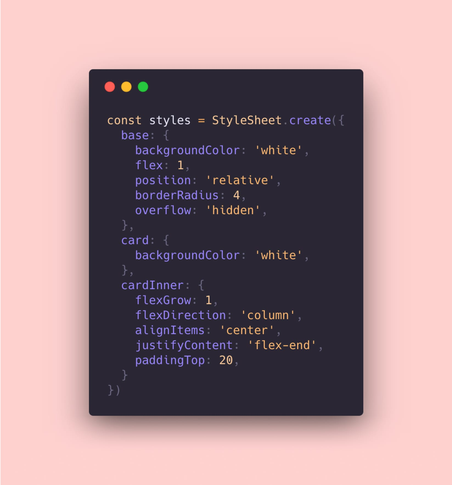
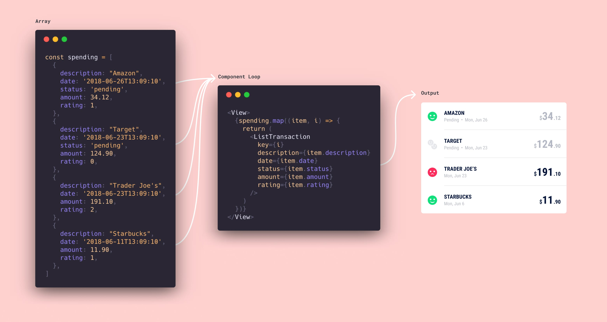

### 4 Lessons Learned Building Joy with React Native

It’s been a year since our mobile app Joy was publicly launched, and it has me getting reflective. As a product Joy has been my baby, I’ve been with it from the beginning and have been honored to help it grow into what it’s become. A lot of that journey has involved me getting hands dirty with code and using React Native to build the UI for the app. Being that I’m a designer and this was my first foray into React Native(or even React), I thought of 4 take-away’s.

## 1.👏Com👏pon👏ents👏

This comes as no surprise to those familiar with React and React Native (and really, the web for the past few years), but as designers are increasingly fixated with building better and more efficient design systems, componentized code just makes everything amazing. I believe what designers are aiming for when making design systems in static form, is fully actualized and realized with componentized code.

Extensible to no-end, thinking in components is a productive mindset for a product designer. Take, for example, a simple button. A button isn’t so simple, because in any app, a button changes based on context with what’s happening on that particular screen, so instead of building 14 buttons, we build 1 component with a whole bunch of options (as “props”).

When adding and removing props, which function as a basic true/false statements, there are styles within the component that are selected/unselected. Choosing an option like isInverse will invert the colors on the button, or isDisabled will dim the button and disable it’s onPress function.

I use a button as my example because the “button” is a quintessential piece of UI. Some designers even overly-obsess over button consistency, accuracy, usage, etc. With how these components are structured, it’s really hard to mess up using buttons. Peace of mind for those button-centric-type-a designers.

With components, I should clarify and it goes with out saying, that this thinking is not exclusive to React; component based apps and website development is very much a thing and for good reason. Code is best when it’s reusable, and that’s what components afford a well written app.

## 2. 🤩 Marveled by CSS-in-JS

Before React Native, my work was web development exclusive, so I understood markup (HTML) and styling (CSS or SCSS) pretty well. For some time leading up to the start of Joy, I was nervous at the prospect of styling React Native, I was unsure what that would be like. But, oh boy, was I relieved once I found out that I could use “CSS-in-JS” for all my styling needs. CSS-in-JS really bridged the gap for me.

Without getting to explain-y and probably getting some of the technical parts wrong; simply put, CSS-in-JS is what it exactly sounds like. The React Native team and community translated almost all of the CSS properties (font-size, transform, z-index, position, flex-grow, etc.) into JavaScript (fontSize, transform, zIndex, position, flexGrow, etc.). The largest difference being that the property names conform to camel case, and the syntax structure conforms to JSON. If you’re curious at the details of what they did watch this video, it’s a great explainer.

You get to leverage the full power of Flexbox for all layout purposes, which I wasn’t super good at going into the project, but now I’m well versed.

All styles are localized to components, and we use a global variables doc that holds all of the colors, spacing increments, font sizes, etc. With this, there is less of an intense need to have global stylesheets.

One of the greatest strengths of CSS-in-JS over Sass/SCSS is the ability to have a global namespace. Since it’s all javascript, variables for styles can be used in functions and functions can be used in styles. This minimizes redundancy of re-writing logic or variables for different languages.

## 3. 🤓 Embrace JSON

This one is less React Native specific, but it’s a lesson I learned none-the-less. So I’ll just say it, I’m convinced, every designer (or non) working on digital products should know how to write JSON. Period. It’s a great way to structure data. It’s what API’s spit out, and it’s just some damn essential stuff. I’m kicking myself that I didn’t understand it sooner.

When building for Joy, I would often be designing and writing product requirements in tandem. Often those requirements involved some data structuring decisions. For example, if I was working on an array of transactions, I don’t want to hard-code those individual transactions. Additionally, I also have to define the data structure for how transactions would return. So I rolled up my sleeves and just wrote the data structure myself.

I looped through that array of transaction objects in my JSX code, and voila! it rendered as my array.

The basics (engineers skip this part) are that there are objects and arrays. Objects are wrapped in curly brackets{} and arrays are wrapped in square brackets [].

It’s important for designers to start thinking this way, because it can bridge the gap between designers and engineers when there is sample data to talk through. Knowing the difference between strings, bools, and functions respective to a JSON table is also important. Read up designers.

## 4. 🤪 Animated Animations

A daunting question I had when heading into React Native development was “how am I going to make things interactive and animated?” I had no idea, but I had a guess that I could. My initial Google searches of “react native animations,” surfaced very few results. However, there was one pattern that kept popping up and it was this guy Jason Brown. He, at that time, was (and… still is) the de-facto thought leader for all things animated with React Native. I mean, sure there was Facebook’s docs, but they had no examples that I could use to wrap my head around.

So, admittedly if it were not for Jason, his Egghead tutorials, his website, the animation book he wrote, and his responding to my desperate tweets, I’d be totally lost on how to animate anything at all. Shameless plug, this guy is the godfather of this stuff. 🙌

Here are a few things I built using React Native’s Animated libraries.

## Wrapping it up

All of these lessons are just the tip of the iceberg in a long list of benefits that I discovered when building Joy. Excited to keep learning more as we keep making Joy better. Also, I’m NOT claiming React Native is the best framework for compiling to native code, but it’s a goodie.

Thanks for reading!

--

** This article was originally published on the Happy Design Team publication, you can [read that here](https://medium.com/happy-design/designer-meets-react-native-159266fb7b3c). **
